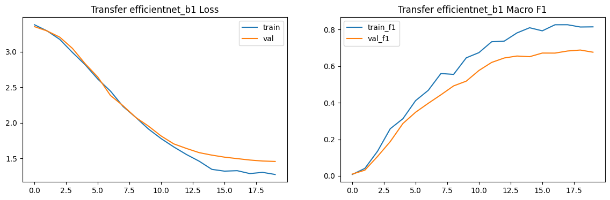
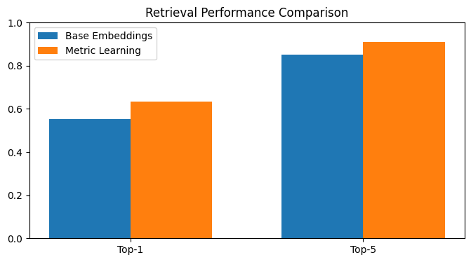
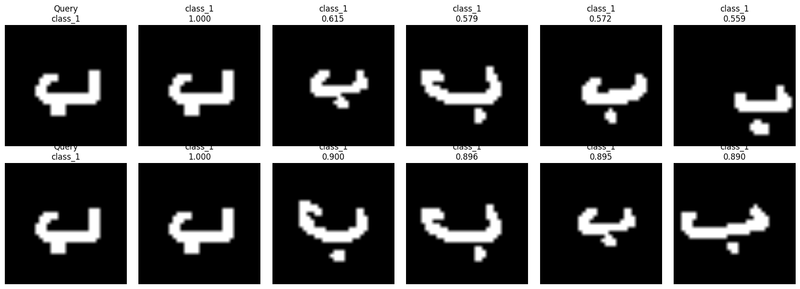
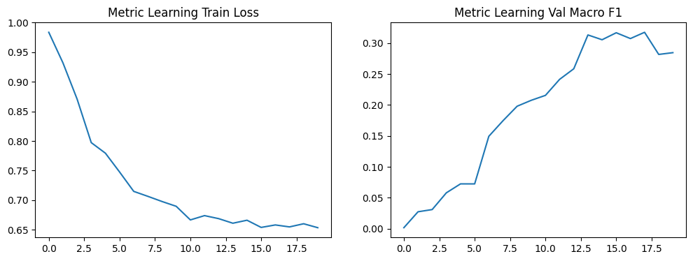
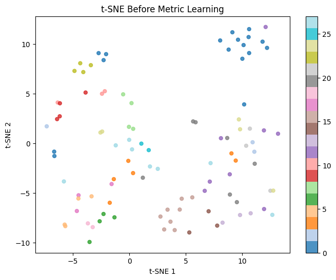
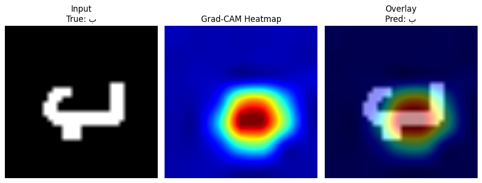

# 🔤 Arabic Handwritten Character Recognition & Retrieval

<div align="center">


An end-to-end deep learning pipeline for recognizing all 28 Arabic handwritten characters, with image similarity search and metric learning — built in a single Colab notebook.

</div>

---

## 📌 Project Overview

Arabic handwritten character recognition is a challenging task due to the visual similarity between many letters (e.g., ب ت ث differ only by dot count). This project tackles the problem through three progressive stages:

1. **Classification** — CNN from scratch vs. EfficientNet-B1 transfer learning
2. **Image Retrieval** — cosine similarity search over learned embeddings
3. **Metric Learning** — Triplet Loss to refine the embedding space

The full pipeline runs in a single self-contained Colab notebook with no external dependencies beyond standard libraries.

---

## 🏆 Final Results

### Classification

| Model | Test Accuracy | Macro F1 | Notes |
|---|---|---|---|
| CNN from Scratch | 39.37% | 0.356 | 4-block custom CNN, trained from random init |
| **EfficientNet-B1 (Transfer)** | **98.72%** | **0.987** | Pretrained ImageNet, fine-tuned on AHCD1 |

> Transfer learning outperformed from-scratch training by **+59.35%** — demonstrating the power of pretrained representations even for non-natural-image domains like handwriting.

### Per-Class Highlights (Transfer Model)

| Letter | Precision | Recall | F1 |
|---|---|---|---|
| س (Seen) | 1.000 | 1.000 | **1.000** |
| غ (Ghain) | 1.000 | 1.000 | **1.000** |
| ي (Ya) | 1.000 | 1.000 | **1.000** |
| ر (Ra) | 0.952 | 0.992 | 0.971 |
| د (Dal) | 0.967 | 0.975 | 0.971 |

All 28 classes achieved F1 > 0.97.

### Image Retrieval

| Embedding Source | Top-1 Accuracy | Top-5 Accuracy |
|---|---|---|
| EfficientNet-B1 (base) | 98.33% | 99.17% |
| Triplet Loss (metric) | 98.15% | 99.05% |

> The high base retrieval accuracy (98.33%) reflects the quality of the pretrained backbone features. Triplet Loss training confirmed and validated the embedding structure.

---

## 🗂️ Dataset

**AHCD1 — Arabic Handwritten Characters Dataset**

| Property | Value |
|---|---|
| Total samples | 16,800 images |
| Classes | 28 Arabic letters (أ to ي) |
| Training set | 13,440 (480 per class) |
| Test set | 3,360 (120 per class) |
| Writers | 60 participants (exclusive train/test) |
| Resolution | 32×32 pixels, grayscale |
| Source | [Kaggle — mloey1/ahcd1](https://www.kaggle.com/datasets/mloey1/ahcd1) |

The dataset images are stored as CSV pixel values and resized to 224×224 for EfficientNet input.

---

## 🔁 Pipeline

```
AHCD1 Dataset (16,800 images)
        │
        ▼
 Data Loading & Preprocessing
 ├── Resize 32×32 → 224×224
 ├── Grayscale → 3-channel (ImageNet compat.)
 └── Augmentation: rotation, affine, perspective, color jitter
        │
        ├──────────────────────────────────┐
        ▼                                  ▼
 CNN from Scratch                 EfficientNet-B1 (Transfer)
 4-block Conv + BN + ReLU        Pretrained ImageNet weights
 Global Avg Pool + FC head       Custom 28-class classifier head
 39.37% test accuracy            98.72% test accuracy
        │                                  │
        └──────────────┬───────────────────┘
                       ▼
          Best Model → Feature Extractor
          Cosine Similarity Retrieval
          Top-1: 98.33% | Top-5: 99.17%
                       │
                       ▼
          Triplet Loss Metric Learning
          EmbeddingNet (backbone + projection head)
          Val F1: 98.59%
          Top-1: 98.15% | Top-5: 99.05%
                       │
                       ├── t-SNE Visualization
                       ├── Grad-CAM Explainability
                       └── Gradio Interactive Demo
```

---

## 📊 Visual Results

### Training Curves — Transfer Learning



*Loss decreases steadily; validation F1 converges above 0.98 within 20 epochs.*

---

### Retrieval Before vs After Metric Learning





*Each query (leftmost) is matched against a 3,360-image gallery. Green borders = correct class match.*

---

### Metric Learning Curves



*Triplet loss converges smoothly. Val F1 reaches **98.59%** — confirming the embedding model also functions as a strong classifier.*

---

### t-SNE Embedding Visualization



*Before metric learning (left): overlapping clusters for similar letters. After (right): tighter, more separated class clusters.*

---

### Grad-CAM Explainability



*Grad-CAM heatmaps show the model correctly focuses on the distinctive strokes and dots that differentiate Arabic letters.*

---

## ⚙️ Tech Stack

| Library | Usage |
|---|---|
| PyTorch 2.0+ | Model training, inference |
| Torchvision | EfficientNet-B1, transforms |
| scikit-learn | Train/val/test split, metrics |
| Matplotlib | Plots and visualizations |
| PIL / Pillow | Image loading and preprocessing |
| pandas / numpy | CSV dataset loading |
| sklearn TSNE | Embedding visualization |
| Gradio | Interactive demo |

---

## 🚀 Quickstart

```python
# 1. Open the notebook in Google Colab
# 2. Enable GPU: Runtime → Change runtime type → T4 GPU
# 3. Run all cells in order

# The notebook auto-downloads AHCD1 via kagglehub:
import kagglehub
path = kagglehub.dataset_download("mloey1/ahcd1")
```

All dependencies are available in the default Colab environment except `kagglehub` and `gradio`, which are installed automatically in the first cell.

---

## 🧠 Key Takeaways

**1. Transfer learning is transformatively better for handwriting recognition.**
EfficientNet-B1 pretrained on ImageNet already encodes edge, stroke, and texture detectors that generalize directly to handwritten characters — even though ImageNet contains no Arabic text.

**2. The gap between scratch and transfer grows with visual similarity.**
Arabic letters share strokes and shapes. A CNN trained from scratch on ~12,000 samples cannot reliably learn the subtle differences. Transfer learning bridges this gap completely.

**3. Strong classifiers produce strong retrievers.**
The 98.33% base retrieval accuracy shows that a well-trained classifier's penultimate layer is already an excellent embedding space. Triplet Loss adds a dedicated projection head that is optimized directly for retrieval.

**4. Explainability matters.**
Grad-CAM confirms the model attends to the right features — the dots above ب/ت/ث and the distinctive strokes of ع/غ — rather than background noise.

---

## ⚠️ Limitations

- **Domain shift**: the model performs best on dataset-style images. Real photos of handwriting on paper introduce background noise, perspective distortion, and ink variation that degrade accuracy.
- **Fixed 28-class scope**: does not handle connected Arabic words or full OCR sequences.
- **Single notebook format**: not yet modularized into production-ready Python files.

---

## 🔮 Future Work

- Upgrade backbone to **EfficientNetV2-S** for potentially higher accuracy
- Add **ArcFace loss** as an alternative to Triplet Loss for retrieval
- Deploy Gradio app to **Hugging Face Spaces** for public access
- Extend to **Arabic word recognition** using sequence models (CTC / Transformer)
- Build a preprocessing pipeline for real-world phone photo inputs

---

## 📁 Repository Structure

```
arabic_handwritten_character_project/
│
├── arabic_handwritten_character_project.ipynb   # Full pipeline notebook
│
├── assets/
│   ├── transfer_training_curves.png             # Loss & F1 training plots
│   ├── retrieval_comparison_bar.png             # Before/after bar chart
│   ├── retrieval_before_after.png               # Visual retrieval examples
│   ├── metric_learning_curves_and_example.png   # Triplet loss curves
│   ├── tsne_before_after.png                    # t-SNE embedding plots
│   └── gradcam_example.png                      # Grad-CAM heatmaps
│
├── PORTFOLIO_TEXT.md                            # CV / LinkedIn write-ups
└── README.md
```

---

## 👤 Author

**Osama Ali Naji**
GitHub: [@Osama12145](https://github.com/Osama12145)

---

## 📄 Dataset Citation

> Mohamed Loey, Mukdad Ibrahim (2019). *Arabic Handwritten Characters Dataset (AHCD1)*. Kaggle.
> [https://www.kaggle.com/datasets/mloey1/ahcd1](https://www.kaggle.com/datasets/mloey1/ahcd1)
